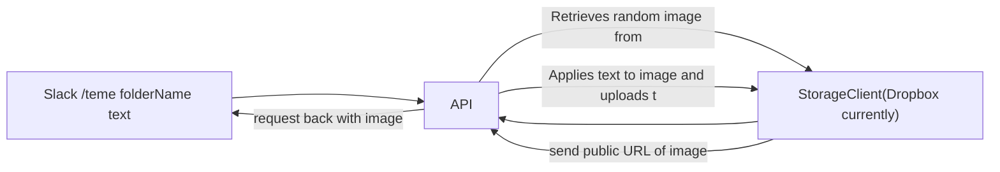

# Teme custom slack bot

## What is Teme?
- A slack bot which can create memes based on a folder of images that you specify.

- An amalgamation of "meme" and "team".
- When inspiration strikes on slack and you want to create a quick meme based on a slack team member, `teme` is a deployable slackbot which can make this request for you.
- Fun fact: this was initially called `meme-say`. I was inspired by [cow-say](https://github.com/sckott/cowsay) and thought it would be great to bring this to slack.

## How does it work?

Slash command - type the name of a team member and the text like so `/teme alex hi;there`.
This will
- Find a folder called `alex` (using a storage provider of choice - currently only dropbox is supported.)
- Choose a random image
- Apply the text (top and bottom text seperated with `;`)
- Ask the user with an ephemeral message(i.e only visible to them), if the preview is adequate, with the choice of shuffling to a new random image and trying again.
- If the user chooses the image - it is sent to the channel.
- Let the fun begin.

### Setup
#### Folder Setup
- Get your dropbox API key by creating a [Dropbox App](https://www.dropbox.com/developers/apps). Ensure it's a secret/ inserted as an ENV variable ([fly.io](https://fly.io/) does this nicely)
  - Scope set up is important.  
- In Dropbox - ensure you have folders which will correlate with a name/meme entity.

#### Deploy
- I used [fly.io](https://fly.io/docs/languages-and-frameworks/node/) to deploy this app.
- Do not forget to set secret/set environment variable for `DROPBOX_API_KEY` before deploying!

## How to install
- Within Slack - go to [Your Apps](https://api.slack.com/apps/) and `Create New App`
- Go to `Slash Commands` and create a new command `/teme`
  - Request Url Should be the endpoint of flyour deployed app
  - It's nice to give a hint like: `name-of-person first-line;second-line`
- Install the app to your workspace
## How to use

- In the channel you want to post a teme, try `/teme [name-of-person] hello;world!`

## Future plans
- Support for more Storage platforms. AWS S3 next.
- A web interface for adding people and photos.

## How it works

