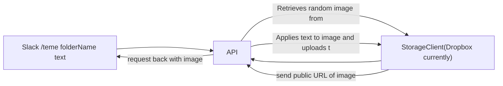

# Teme custom slack bot

## What is Teme?
- Given a slack slash `/teme [folderName] [top-text;bottom-text]` does the following
  - retrieves a random image from the specified `folderName`
  - appends text to the image in a meme format with the specified `[top-text;bottom-text]`
  - The interface looks like this - where you're given a preview of the image and can shuffle until it finds a random photo in the folder  that you're happy with - where the folder exists in the storage provider of choice (currently only dropbox is supported).

- An amalgamation of "meme" and "team".
- Fun fact: this was initially called `meme-say`. I was inspired by [cow-say](https://github.com/sckott/cowsay) and thought it would be great to bring this to slack.

## How does it work in a team context?

Folder names are usually the name of a slack team member. For example if you wanted to meme your team member called Alex - there would be a folder  called alex, with a collection of `alex` images. You can channel meme alex with imagery with `/teme alex i heart;e2e`.

### Setup
#### Folder Setup
- Get your dropbox API key by creating a [Dropbox App](https://www.dropbox.com/developers/apps). Ensure it's a secret/ inserted as an ENV variable ([fly.io](https://fly.io/) does this nicely)
  - Scope set up is important.  
- In Dropbox - ensure you have folders which will correlate with a name/meme entity.

#### Deploy
- I used [fly.io](https://fly.io/docs/languages-and-frameworks/node/) to deploy this app.
- Do not forget to set secret/set environment variable for `DROPBOX_API_KEY` before deploying!

## How to install
- Within Slack - go to [Your Apps](https://api.slack.com/apps/) and `Create New App`
- Go to `Slash Commands` and create a new command `/teme`
  - Request Url Should be the endpoint of flyour deployed app
  - It's nice to give a hint like: `name-of-person first-line;second-line`
- Install the app to your workspace
## How to use

- In the channel you want to post a teme, try `/teme [name-of-person] hello;world!`

## Future plans
- Support for more Storage platforms. AWS S3 next.
- A web interface for adding people and photos.

## How it works

